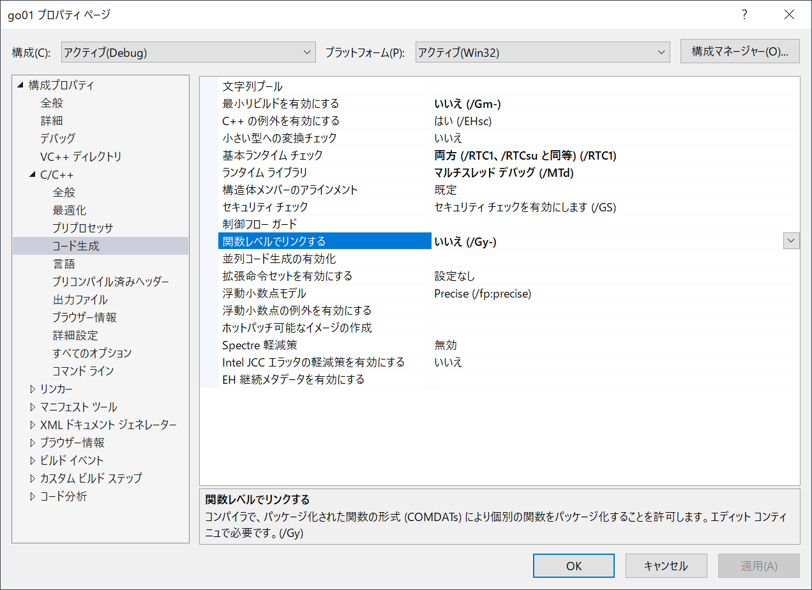

# cgf-training-cource-20150807

http://entcog.c.ooco.jp/entcog/cg_koushu.html

## Run

Windows で Visual Studio を使っているなら、 `*.dsw` ファイルをダブルクリックしてください。  

## Change log

```plain
重大度レベル	コード	説明	プロジェクト	ファイル	行	抑制状態
警告	D9035	オプション 'Gm' の使用は現在推奨されていません。今後のバージョンからは削除されます。	go01	C:\GitHub\cgf-training-cource-20150811\01\cl	1	
```

  
[最小リビルドを有効にする]オプションを `いいえ(/Gm-)` に変更しました。  

```plain
重大度レベル	コード	説明	プロジェクト	ファイル	行	抑制状態
エラー	D8016	コマンド ライン オプション '/ZI' と '/Gy-' は同時に指定できません	go01	C:\GitHub\cgf-training-cource-20150811\01\cl	1	
```

  
  

とりあえず [関数レベルでリンクする]オプションを `はい(/Gy)` に変更しました。  
